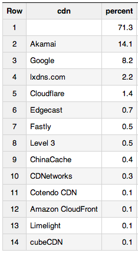
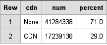
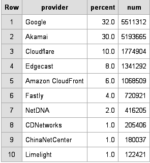
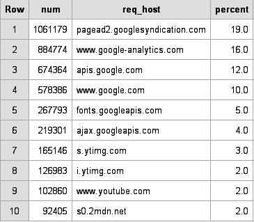
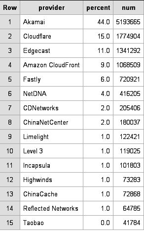
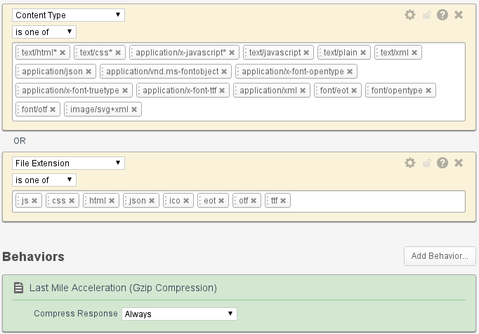
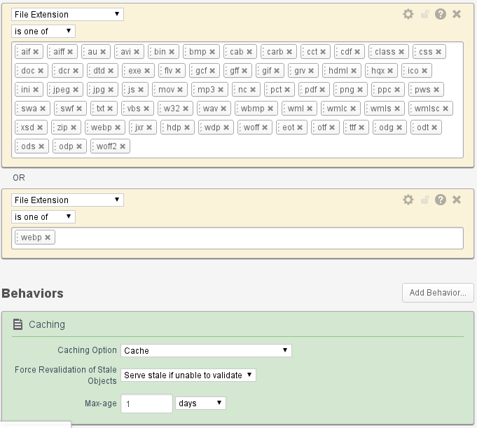

O que colocar para CDN fazer compressão (gzip) 

Estava lendo um [texto](http://www.fastly.com/blog/new-gzip-settings-and-deciding-what-to-compress/) do Steve Souders sobre a alteração da configuração padrão gzip na Fastly. Fastly é uma CDN concorrente da Akamai e tem clientes como Twitter, Shopify, The Guardian, Rakuten, etc. 

Ele cita como chegaram no template padrão da configuração deles usando os dados do [HTTP Archive](http://httparchive.org/), ele é um projeto que consolida testes executados usando a versão pública do [Webpagetest](http://www.webpagetest.org/). Os testes são executados em mais ou menos 18 mil URLs e tem [relatórios](http://httparchive.org/trends.php) variados sobre número médio de requisições HTTP por página, crescimento do HTML nas páginas, etc. 

Tanto do Steve Souders quanto no site HTTP Archive tem referência ao [Bigqueries](http://httparchive.org/) com diversas consultas realizadas na base dados do HTTP Archive. Um [texto postado](http://bigqueri.es/t/top-base-page-cdns-for-top-urls/58) no Bigqueries chamou-me a atenção, era sobre o Raking de CDNs considerandos as páginas mais populares. 

 No entando, qual seria o percentual de requisisções HTTP que foram entregues por CDNs? Considerando o mês de Novembro de 2014.

 E quais foram as CDNs mais usadas naquele período?

A surpresa no ranking é o Google, porque ele seria considerado uma CDN?

Para tentar entender, usando a mesma amostragem de dados e buscando os principais hostnames/domínios que estão na CDN do Google.

Basicamente, a CDN da Google entrega seus serviços: Analytics, Adsense, Doubleclick, Youtube, etc. Os hostnames fonts.googleapis.com, ajax.googleapis.com estão relacionados a iniciativas do Goolgle de hospedar alguns frameworks javascripts e webfonts gratuitamente. 

Tudo isso poderia ser considerado uma CDN? A inexistência de um documento canonical que defina a CDN, a Wikipedia tem artigo sobre CDN e a primeira frase tem uma boa definição

"*A ***_content delivery network_*** or ***_content distribution network_*** (***_CDN_***) is a large distributed system of **[server*s](http://en.wikipedia.org/wiki/Server_(computing))* deployed in multiple **[data center*s](http://en.wikipedia.org/wiki/Data_centers)* across the **[Interne*t](http://en.wikipedia.org/wiki/Internet)*. The goal of a CDN is to serve content to end-users with high availability and high performance. CDNs serve a large fraction of the Internet content today, including web objects (text, graphics and scripts), downloadable objects (media files, software, documents), applications (e-commerce, portals), **[live streamin*g](http://en.wikipedia.org/wiki/Live_streaming)* media, on-demand streaming media, and **[social network*s](http://en.wikipedia.org/wiki/Social_networks)*.*"

Considerando a definição da Wikipedia, pode-se afirmar que a HTTP Archive coloca o Google como CDN apropiadamente. Entretanto, se desconsider o Google como CDN e consideramos que as demais restantes são CDNs que seus usuários paguem para usá-las. Como ficaria o ranking com as 15 mais usadas?

Dentre as acima listadas, as que tem ou tera ponto de presença no Brasil: Akamai, Cloudflare, EdgeCast, CloudFront, Fastly, MaxCDN (NetDNA), CDNetwokrs, ChinaNetCenter, Level3, Incapsula e Highwinds. 

Voltando ao início e a texto do Souders sobre compressão, ele propôs que habilite/configure a compressão quando as respostas HTTP tiverem :

**Extensions**: *js css html json ico eot otf ttf*

Ou

**Content-Type**: *text/html application/x-javascript text/css application/javascript text/javascript text/plain text/xml  application/json  application/vnd.ms-fontobject application/x-font-opentype application/x-font-truetype application/x-font-ttf application/xml font/eot font/opentype font/otf image/svg+xml image/vnd.microsoft.icon*

A configuração padrão na Akamai é:

**Content-Type**: *text/html* text/css* application/x-javascript* text/xml* text/plain* application/json* text/javascript*	*

Fazendo consulta similar ao do Souders para saber  "Quais os content-types mais mais recorrentes acima de 1 mil recorrências e que tiveram compressão habilitada?". 

<table>
  <tr>
    <td>Row</td>
    <td>content_type</td>
    <td>num</td>
    <td>percent</td>
  </tr>
  <tr>
    <td>1</td>
    <td>application/javascript</td>
    <td>24</td>
    <td>312999</td>
  </tr>
  <tr>
    <td>2</td>
    <td>text/css</td>
    <td>23</td>
    <td>299896</td>
  </tr>
  <tr>
    <td>3</td>
    <td>application/x-javascript</td>
    <td>22</td>
    <td>285845</td>
  </tr>
  <tr>
    <td>4</td>
    <td>text/javascript</td>
    <td>12</td>
    <td>149466</td>
  </tr>
  <tr>
    <td>5</td>
    <td>text/html</td>
    <td>11</td>
    <td>141556</td>
  </tr>
  <tr>
    <td>6</td>
    <td>application/octet-stream</td>
    <td>2</td>
    <td>24468</td>
  </tr>
  <tr>
    <td>7</td>
    <td>application/vnd.ms-fontobject</td>
    <td>2</td>
    <td>21922</td>
  </tr>
  <tr>
    <td>8</td>
    <td>text/plain</td>
    <td>1</td>
    <td>15761</td>
  </tr>
  <tr>
    <td>9</td>
    <td>application/json</td>
    <td>1</td>
    <td>12367</td>
  </tr>
  <tr>
    <td>10</td>
    <td>text/xml</td>
    <td>1</td>
    <td>12175</td>
  </tr>
  <tr>
    <td>11</td>
    <td>text/x-component</td>
    <td>0</td>
    <td>4382</td>
  </tr>
  <tr>
    <td>12</td>
    <td>application/xml</td>
    <td>0</td>
    <td>3446</td>
  </tr>
  <tr>
    <td>13</td>
    <td>text/x-js</td>
    <td>0</td>
    <td>3254</td>
  </tr>
  <tr>
    <td>14</td>
    <td>application/x-shockwave-flash</td>
    <td>0</td>
    <td>2724</td>
  </tr>
  <tr>
    <td>15</td>
    <td>application/x-font-ttf</td>
    <td>0</td>
    <td>2491</td>
  </tr>
  <tr>
    <td>16</td>
    <td>font/woff</td>
    <td>0</td>
    <td>1694</td>
  </tr>
  <tr>
    <td>17</td>
    <td>application/x-www-form-urlencoded</td>
    <td>0</td>
    <td>1031</td>
  </tr>
</table>

Da lista, pode-se descartar alguns: *application/octet-stream* (formato genérico de arquivos), *text/x-component* (formato microsoft antigo, não mais usado), *application/x-shockwave-flash*, *font/woff* e *application/x-www-form-urlencoded*.  Os três últimos são formatos já com compressão e fazer compressão num servidor web ou CDN é usar o processamento desnecessariamente.

Juntado as listas, a regra a ser configurado no servidor web, proxy reverso ou CDN será:

**Extensions**: *js css html json ico eot otf ttf*

**Content-Type**: *text/html application/x-javascript text/css application/javascript text/javascript text/plain text/xml  application/json  application/vnd.ms-fontobject application/x-font-opentype application/x-font-truetype application/x-font-ttf application/xml font/eot font/opentype font/otf image/svg+xml image/vnd.microsoft.icon* **text/x-js**.

Acrescentado o text/x-js na lista de Content-Type, um site poderá ter mais requisições HTTP compressão, consequentemente o site terá o tráfego de rede menor. Claro, sem esquecer de mencionar que o usuário poderá ter uma experência melhor com as páginas do site já que elas poderão ser menores e mais rápidas.

Nas novas configurações na Akamai estou acrescentando os Content-Type e os arquivos para as regras de compressão e cache como abaixo:

**Regra de compressão**

**Regra de Cache**

Os resultados e comentários sobre ranking das CDNs estão no [texto](http://bigqueri.es/t/whats-the-popularity-of-different-cdns/477/2) que [publiquei](http://bigqueri.es/t/whats-the-popularity-of-different-cdns/477/2) no Bigqueries.

**Links**

[http://httparchive.org/](http://httparchive.org/)

[http://httparchive.org/trends.php](http://httparchive.org/trends.php)

[http://en.wikipedia.org/wiki/Content_delivery_network](http://en.wikipedia.org/wiki/Content_delivery_network)

[http://www.fastly.com/blog/new-gzip-settings-and-deciding-what-to-compress/](http://www.fastly.com/blog/new-gzip-settings-and-deciding-what-to-compress/)

[http://bigqueri.es/t/whats-the-popularity-of-different-cdns/477](http://bigqueri.es/t/whats-the-popularity-of-different-cdns/477)

[https://cloud.google.com/bigquery/query-reference](https://cloud.google.com/bigquery/query-reference)

[https://code.google.com/p/re2/wiki/Syntax](https://code.google.com/p/re2/wiki/Syntax)

[https://bigquery.cloud.google.com/queries/totemic-chimera-789](https://bigquery.cloud.google.com/queries/totemic-chimera-789)

